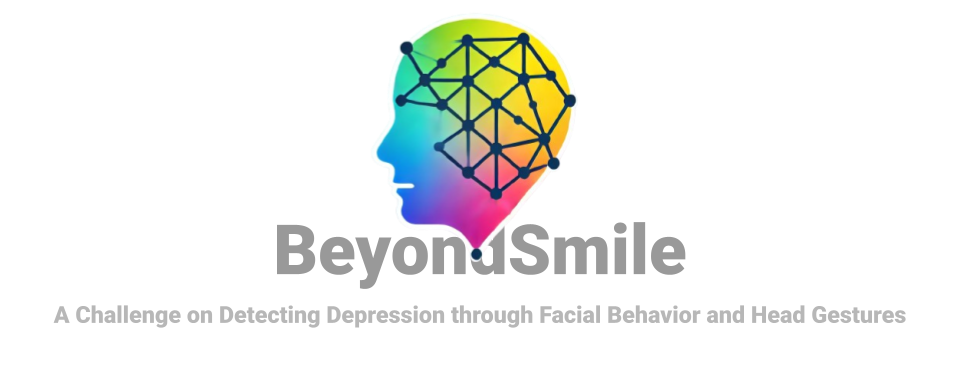
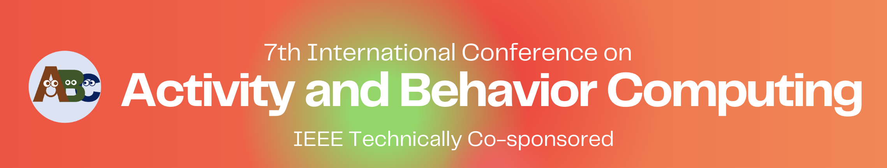

This challenge is part of the **[7th International Conference on Activity and Behavior Computing](https://autocare.ai/abc2025)**.



---

## Dataset Information

The dataset used for this challenge was collected as part of the FacePsy study. It contains facial behavior and head gesture data aimed at detecting depressive episodes. The dataset is available for download:

**[Download Dataset](https://github.com/stevenshci/BeyondSmile/releases/download/ABC2024/dataset.zip)**

### Dataset Structure
```

dataset/ 
├── data/ 
│ ├── P08.json
│ ├── P10.json 
│ ├── ... 
│ └── P38.json 
├── groundtruth/ 
│ └── phq9.csv
```


### Data Description
- **`data/`:** Contains participant data in JSON format, capturing facial features and behavior during the study. A feature description can be found in [here](https://github.com/stevenshci/BeyondSmile/blob/main/sample/datasetDescription.pdf)
- **`groundtruth/`:** Includes `phq9.csv`, which provides the PHQ-9 scores used as ground truth for depressive episode labeling. The `phq9.csv` ground truth has columns as
  -  **`pid`:** Participant ID of the the participants. For each participant, we have one JSON file in the `data/` folder.
  -  **`start_ts`:** Start of oberservation period. An observation period has a length of 2 weeks.
  -  **`end_ts`:** End of the observation period. NOTE: Some participants may have reported their PHQ-9 a few days after the 2-week period. For those observations, the length may be a few days longer.
  -  **`start_phq9`:** PHQ-9 score at the start of observation period.
  -  **`end_phq9`:** PHQ-9 score at the end of the observation period.
  -  **`depression_episode`:** Depression label. A participant observation period (i.e., 2 weeks) is labeled as having a depressive episode(label=1) if and only if the participant reported PHQ-9 >= 5 both at the start and end of the observation period; otherwise, it is labeled a non-depressive (label=0).

---

## Tutorial

A detailed tutorial for processing and analyzing the dataset is available in **[Tutorial.ipynb](https://github.com/stevenshci/BeyondSmile/blob/main/Tutorial.ipynb)**.

---

## Evaluation Guidelines

The evaluation involves building models to predict depressive episodes using the dataset. There are two evaluation approaches:
1. **Universal Model:**  
   - Train a single model using all participant data.
   - Use leave-one-participant-out (LOPO) cross-validation.
   - Evaluate using metrics like AUROC, Accuracy, Precision, Recall, F1 Score.

2. **Hybrid Model:**  
   - Combine user-specific data with general data for training.
   - Use nested cross-validation (e.g., leave-one-participant-day-out with time-series awareness).
   - Focus on personalized depression detection while maintaining generalizability.

---

## Citation

If you use this dataset, please cite the FacePsy paper:

```
@article{10.1145/3676505,
author = {Islam, Rahul and Bae, Sang Won},
title = {FacePsy: An Open-Source Affective Mobile Sensing System - Analyzing Facial Behavior and Head Gesture for Depression Detection in Naturalistic Settings},
year = {2024},
issue_date = {September 2024},
publisher = {Association for Computing Machinery},
address = {New York, NY, USA},
volume = {8},
number = {MHCI},
url = {https://doi.org/10.1145/3676505},
doi = {10.1145/3676505},
month = sep,
articleno = {260},
numpages = {32},
keywords = {affective computing, application instrumentation, depression, empirical study that tells us about people, field study, machine learning, mobile computing, system}
}
```
---

## Contact

For any inquiries, please contact **Rahul Islam** at [rahul.islam3@gmail.com](mailto:rahul.islam3@gmail.com).

---
